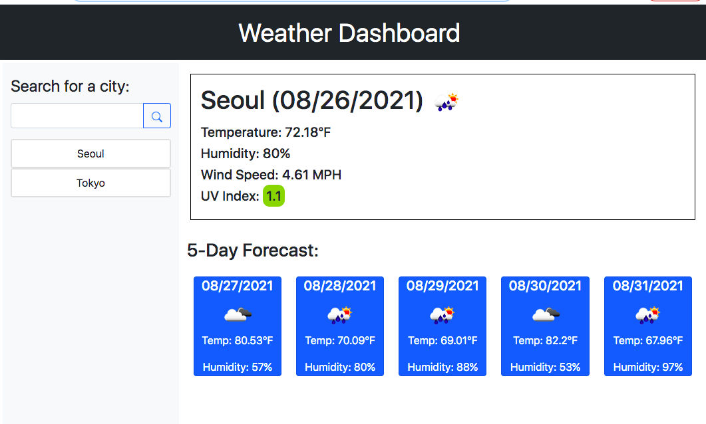

# weatherApp

For this assignment, I have created a weather dashboard with html, css, and js to show the current and 5 day forecast weathers of any city the user inputs. The user can type in any city in the search box. When they do, the current city weather data will appear on the top right. In addition, the 5-day forecast data will appear on the bottom right. When the user inputs another city, the previous city will appear in a search history box. The previous search will show on the bottom with the newest search appearing on the top.

Currently, I am unable to figure out the code to show the previous city weather data when the city in the search history is click.

-Still work in progress-
WHEN I click on a city in the search history
THEN I am again presented with current and future conditions for that city

URL: https://remireems.github.io/weatherApp/

Screenshot:
